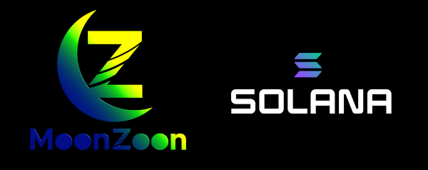
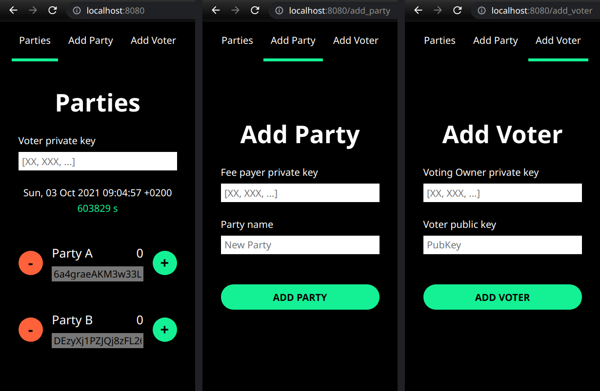
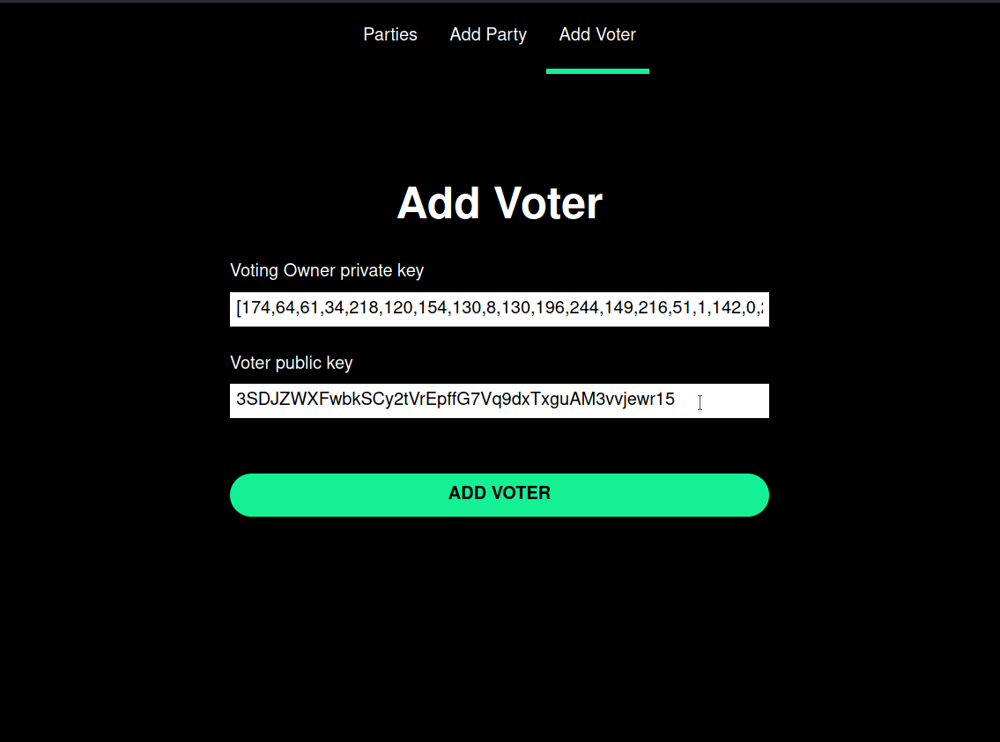
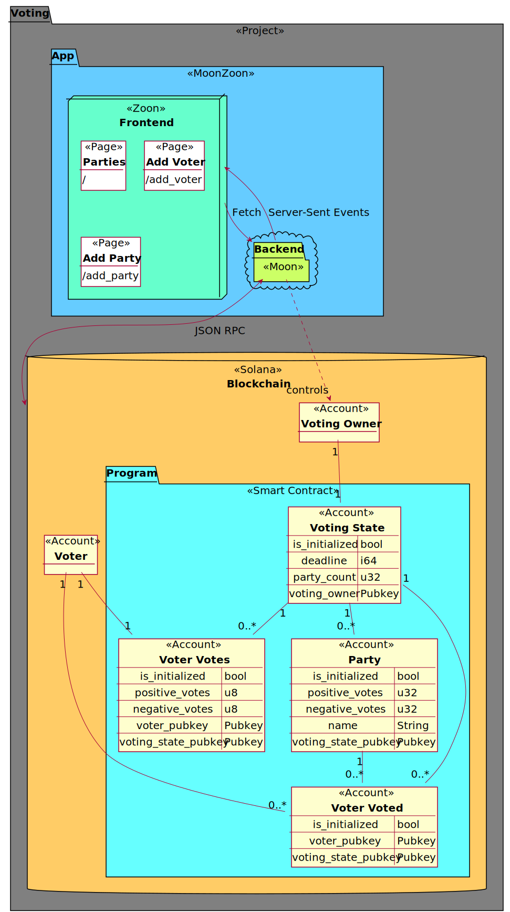

# Voting example

The [Rust](https://www.rust-lang.org/)-only Voting example based on MoonZoon and Solana.

- [MoonZoon](http://moonzoon.rs/) is a Rust Fullstack Framework.

- [Solana](https://solana.com/) is a decentralized blockchain.

- _Note:_ This is not an official Solana example. The author is the MoonZoon's creator.

---

## Run on a local machine

Follow the steps in [./program/README.md](./program/README.md)
and then the ones in [./app/README.md](./app/README.md).

---

## Pages

### Add Voter

The page allows you to add a _voter_. 

- A _voter_ is a regular Solana account. The app makes the voter eligible for voting by creating a _voter votes_ account associated with the given voter and the _voting state_. 

- A _voting state_ is an account created by the app during the start (if not created yet) and associated with the _voting owner_. Voters are allowed to vote for 1 week - the _deadline_ is set in the _voting state_ account.

- A _voting owner_ is an account fully controlled by the app.

- You can find the pre-filled text input values in:
   - [./program/keypairs/voting-owner-keypair.json](./program/keypairs/voting-owner-keypair.json)
   - [./program/keypairs/voter-pubkey](./program/keypairs/voter-pubkey)

_Note:_ See the section [Architecture](#architecture) for the visual representation of all relations.

### Add Party

The page allows you to add a _party_. 

- A _party_ is an account created by the app with the required party name and associated with the _voting state_.

- Everybody with a sufficient amount of lamports can create a party.

- You can find the pre-filled private key in:
   - [./program/keypairs/voter-keypair.json](./program/keypairs/voter-keypair.json)

_Note:_ You need to insert the private key in the text input because wallet integrations is out of scope of this example.
- There wasn't (?) a Rust wallet connector at the time of writing and developing a new one from scratch or writing binding for JS libs like [sol-wallet-adapter](https://github.com/project-serum/sol-wallet-adapter) is too time consuming.

### Parties

The page allows you to vote for the selected _party_. 

- You can vote if you are eligible for voting (i.e. you've been registered on the page "Add Voter".)

- You have 2 positive votes and 1 negative votes.

- You can vote only once for each party.

- You can send your negative vote only after you've already spent all your positive votes.

- Party votes are updated in real time (just like adding a party).

- You can find the pre-filled private key in:
   - [./program/keypairs/voter-keypair.json](./program/keypairs/voter-keypair.json)

_Note:_ This kind of a voting system is called [D21 - Janeček method](https://www.ih21.org/en/d21-janecekmethod).

---

## Architecture

The frontend part is based on the VDOM-less Rust frontend framework Zoon and compiled to Wasm. It means we can use the crate [solana-sdk](https://crates.io/crates/solana-sdk) directly instead of using intermediate Javascript libraries ([@solana/web3.js](https://solana-labs.github.io/solana-web3.js/)). 

The advantages are:

- Reduced complexity caused by multiple languages and their ecosystems in one project. It leads to faster development, better Developer eXperience and fewer bugs.

- Improved performance thanks to Wasm + Rust. I can imagine that especially cryptographic operations are much faster in the Wasm runtime and could be parallelized in the future (if we can't use native browsers APIs like Web Crypto API). Also Zoon is faster than React or Svelte according to the [benchmarks](https://github.com/MoonZoon/MoonZoon#size--speed).

- Onboarding and collaboration among team members should be easier thanks to one language in the tech stack and Rust static typing and other features.

The frontend doesn't communicate directly with the blockchain because:

- There is a business logic implemented in the backend. It also needs the access to the voting owner's keypair.

- The crate [solana-client](https://crates.io/crates/solana-client/1.7.12) isn't suitable for the frontend - e.g. the transitive dependency [url](https://crates.io/crates/url/2.2.2) may even double the output Wasm file size. `serde` is another "heavy" dependency that could be replaced in the future.

- `solana-client` doesn't cover all Solana real-time APIs currently.

- Solana APIs are [rate limited](https://docs.solana.com/cluster/rpc-endpoints). We can, for instance, cache responses to avoid client fails.

- The combination Fetch + Server-Sent Events may be superior to WebSockets in some cases (e.g. better compatibility with proxies and firewalls). However it depends on the app requirements.

- The blockchain isn't very suitable for (complex) queries. You can query data mirrored in a database instead.

_Note_: The schema below has been generated from the file [./docs/architecture.puml](./docs/architecture.puml).

---

## Contributing

- Share your ideas and opinions on the [MoonZoon Discord](https://discord.gg/eGduTxK2Es).

- File an issue in the GitHub repo when you encounter a bug or problems in docs.

- Please use `cargo fmt` and `cargo clippy` and squash commits if it makes sense (I rebase PRs). 

---

## Solana Questions & Answers

It's my ([@MartinKavik](https://github.com/MartinKavik)) first project with Solana / blockchain. Naturally, I had some beginner questions about the API, architecture and best practices. And I was lucky enough to get answers from the Solana master [@jstarry](https://github.com/jstarry) who works in Solana Labs.

So I recommend to read these Q&A before your start to work on your Solana project. (_Note_: The repo hasn't been updated to follow recommendations mentioned in the answers.)

[Questions.md](./questions.md)
